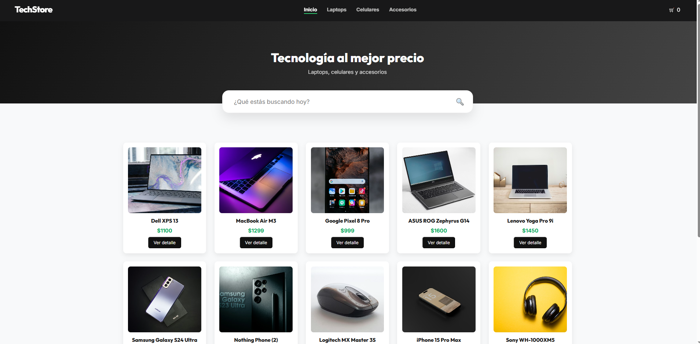
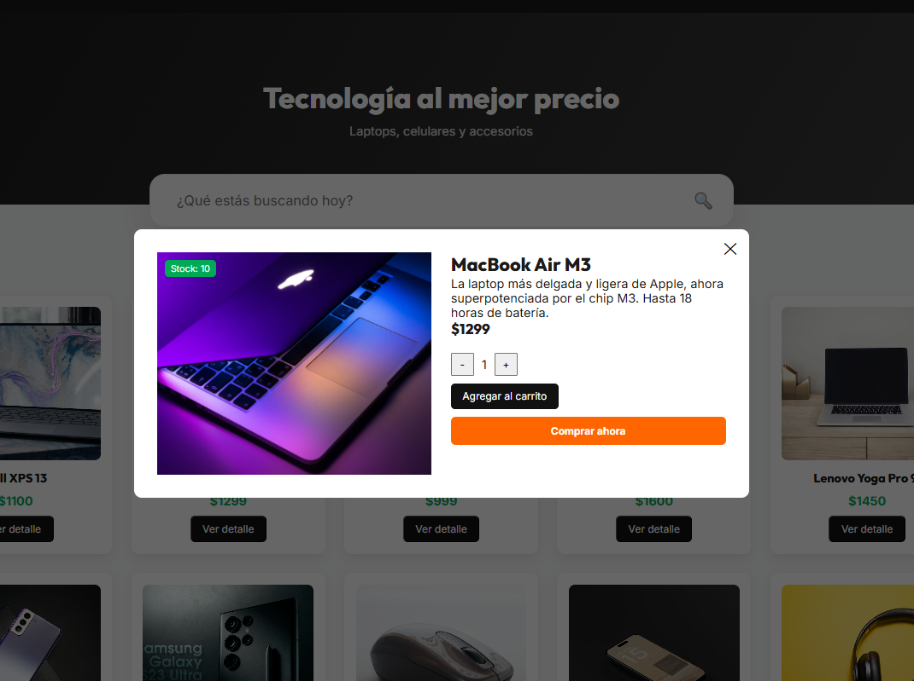
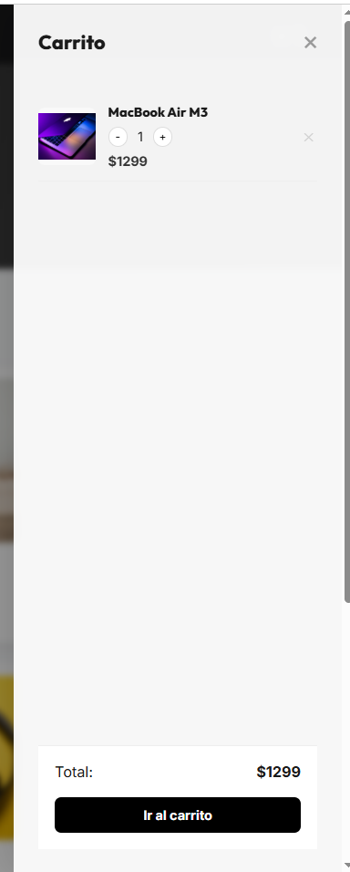
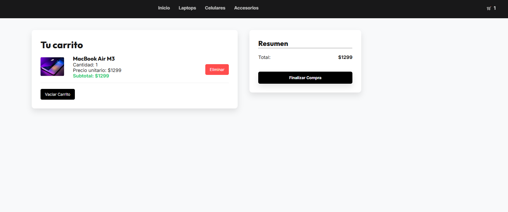
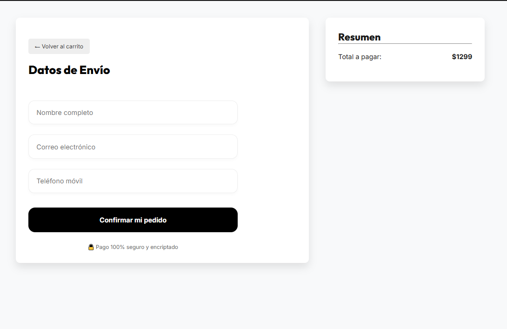
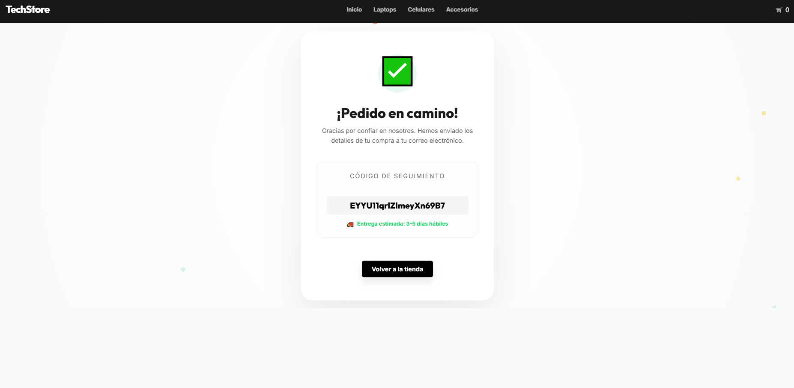

# ProyectoFinal-Bazalar

E-commerce desarrollado con React y Firebase para el curso de CoderHouse. La temática elegida es una tienda de tecnología llamada **TechStore**.

## Descripción

El proyecto es una SPA (Single Page Application) que permite navegar por un catálogo de productos tecnológicos (laptops, celulares y accesorios), ver el detalle de cada uno, agregarlos al carrito y finalizar la compra completando un formulario. Al confirmar, se genera una orden en Firestore con los datos del comprador y los productos seleccionados.

## Instalación

1. **Clonar el repositorio**:
   ```bash
   git clone https://github.com/Dbazalar5/ProyectoFinal-Bazalar.git
   ```

2. **Navegar al directorio del proyecto**:
   ```bash
   cd ProyectoFinal-Bazalar
   ```

3. **Instalar dependencias**:
   ```bash
   npm install
   ```

4. **Cargar productos a la base de datos**:
   Si quieres usar mi misma lista de productos en tu propio proyecto de Firebase, una vez configurado el `.env`, ejecuta:
   ```bash
   npm run seed
   ```

5. **Ejecutar en desarrollo**:
   ```bash
   npm run dev
   ```

## Librerías utilizadas

- React
- React Router Dom
- Firebase (Firestore)
- Vite

## Estructura del proyecto

```
src/
├── components/
│   ├── Cart/
│   ├── CartWidget/
│   ├── CheckoutForm/
│   ├── Hero/
│   ├── Item/
│   ├── ItemCount/
│   ├── ItemDetail/
│   ├── ItemDetailContainer/
│   ├── ItemList/
│   ├── ItemListContainer/
│   ├── NavBar/
│   ├── NotFound/
│   ├── OrderSuccess/
│   └── SideCart/
├── context/
│   ├── CartContext.jsx
│   └── SearchContext.jsx
├── firebase/
│   └── config.js
└── App.jsx
```

## Funcionalidades

- Navegación por categorías con React Router
- Detalle de producto con selector de cantidad
- Carrito de compras con Context API
- Validación de formulario de compra
- Generación de orden en Firestore
- Buscador de productos en tiempo real
- Sidebar del carrito

## Variables de entorno

El proyecto usa variables de entorno para las credenciales de Firebase. Hay un archivo `.env.example` con los nombres de las variables que se necesitan configurar:

```
VITE_API_KEY=tu_api_key
VITE_AUTH_DOMAIN=tu_auth_domain
VITE_PROJECT_ID=tu_project_id
VITE_STORAGE_BUCKET=tu_storage_bucket
VITE_MESSAGING_SENDER_ID=tu_messaging_sender_id
VITE_APP_ID=tu_app_id
```

Copiar `.env.example` como `.env` y completar con los valores correspondientes.

## Capturas de pantalla







